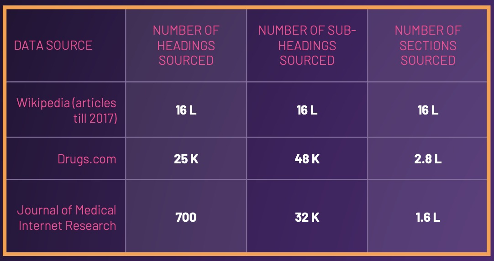
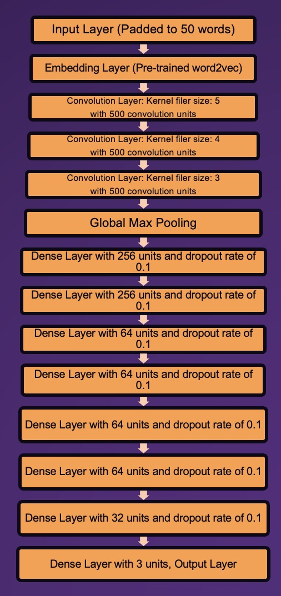
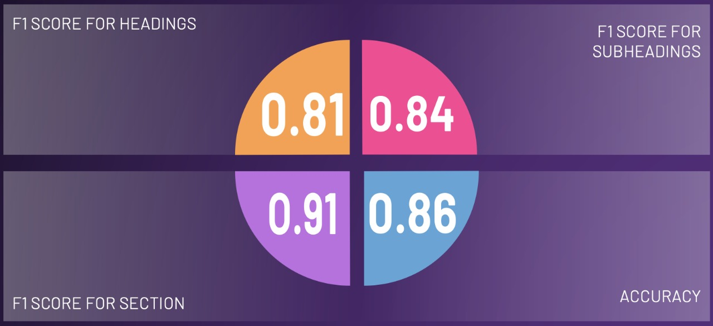

# AstraZeneca-AI-Hackathon

## Introduction
___
On January 2022, AstraZeneca organised an AI hackathon as part of Shasstra-2022. About 559 teams registered for the hackathon. 
> "Our problem statement is simple, analyse different documents and tag the respective contents into 3
different categories - Heading, Sub-Heading ,Section"

* The main task given to the teams is to segment documents into headings, sub-headings and sections.
* The documents can be of format .doc, .docx and .txt.
* This way we can find a critical information from large database of documents. This is critically important for medical documents where, for example, an user might be interested to find known side effects of a drug or a doctor needs to find critical information from millions of research papers.
  
## Our approach:
### Data Collection:
* The first challenge for us was to collect "labelled data". We used millions of article from wikipedia as the primary source of data.
* In order to make the model more generic to medical documents as well, we scrapped all open source articles present in [drugs.com](drugs.com)and [jmir.com](jmir.com).
* All together we sourced 2,30,52,681 documents. (Majority wikipedia articles).
* From this 23 million of data, we sampled 1.6 million headings, sub headings and sections. We took all avaialable headings, sub- headings and sections from drugs.com and jmir.com.
* 

### Preprocessing:
* Some data cleaning was done on the wikipedia data, like removing \<ref> tags present in some headings, removing symbols, numbers, etc.
* Over sampling was done from drugs.com and jmir.com to increase weightage.
* Padding was done for a length of 50 characters.

### Model:
* We had a lot of data! This created a new problem. The data couldn't completely be fitted into memory! 
* To overcome this issue, we chopped down the data points to 50 chunks. (Each chunk contains 1 lakh of stratefied data points)
* We tried out pretrained models like BERT, CNN, LSTM and also simple ML models.
* We discovered that BERT, CNN, LSTM all gave similar results. This is because of the huge amount of data that we sourced. ML models also performed well, but Deep Learning models performed better.
* We used 200 dimention word2vec and CNN for final submission. We didn't use BERT or LSTM mainly because CNN was much simpler.
* 

### Model Performance

* 

### The coding problem:
* The next task was to write a algorithm to read txt, doc, docx formats.
* Reading and writing to a text file was straight-forward.
* We used docx library in python to handle docx.
* For doc format, we used code that will convert doc to docx provided MS-Word is installed using win32com library.

### Improvements:
* One of the problem we faced was class imbalance. Though we tried to overcome it through over-sampling, a better solution, we realised was to use weighted entropy. Unfortunately we didn't had enough time to retrain the model.
* A longer paddings and larger word embeddings would have boosted the performace of the model at expense of larger compuational power.

### Note:
Due to file size restictions on github, some of the files including model weights are removed. The full submission is uploaded to this [link](https://drive.google.com/drive/folders/1Mq0SpftZonAFHFMZBiW6n16i7hPJ-umU).
